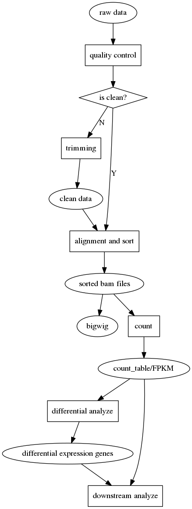

RNA-Seq
=======

The pipeline for RNA-Seq upstream data processing.

## pipeline


## softwares

### Quility control

* [Fastqc](https://www.bioinformatics.babraham.ac.uk/projects/fastqc/)
* [Trimmomatic](http://www.usadellab.org/cms/?page=trimmomatic)

### Aligner

* [bowtie2](http://bowtie-bio.sourceforge.net/bowtie2/index.shtml)
* [hisat2](https://ccb.jhu.edu/software/hisat2/index.shtml)
* [bwa](http://bio-bwa.sourceforge.net/)

### Other

* [samtools](http://samtools.sourceforge.net/)
* [deepTools](https://deeptools.readthedocs.io/en/latest/)
* [HTSeq](https://htseq.readthedocs.io/en/release_0.9.1/overview.html)

## Reference Genome

### Human
* [hg19 fasta file](http://hgdownload.cse.ucsc.edu/goldenpath/hg19/chromosomes/)
* hg19 gtf file: Export from [UCSC hgTables](http://genome.ucsc.edu/cgi-bin/hgTables)

### Mouse

### MTB

#### H37Ra
* [fasta](ftp://ftp.ensemblgenomes.org/pub/bacteria/release-37/fasta/bacteria_13_collection/mycobacterium_tuberculosis_h37ra/dna/)
* [gtf](ftp://ftp.ensemblgenomes.org/pub/bacteria/release-37/gtf/bacteria_13_collection/mycobacterium_tuberculosis_h37ra)

#### H37Rv
* [fasta](ftp://ftp.ensemblgenomes.org/pub/bacteria/release-37/fasta/bacteria_0_collection/mycobacterium_tuberculosis_h37rv/dna/)
* [gtf](ftp://ftp.ensemblgenomes.org/pub/bacteria/release-37/gff3/bacteria_0_collection/mycobacterium_tuberculosis_h37rv)

## Commands and scripts usage example:

```bash

```
