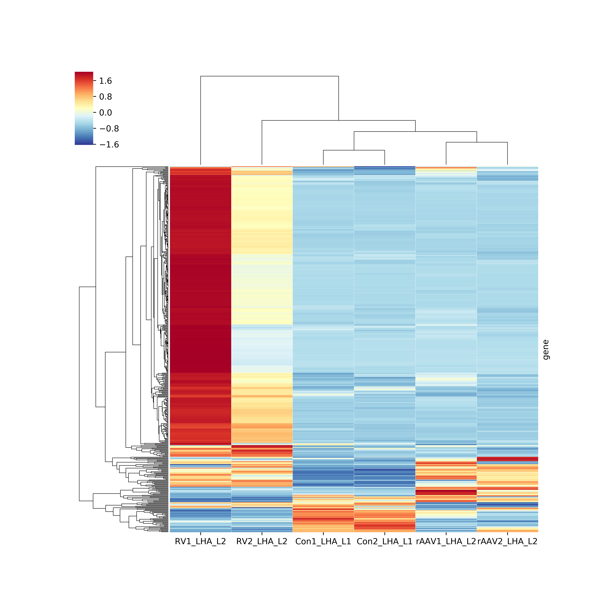

RNA-Seq
=======

The pipeline for RNA-Seq upstream data processing.

## pipeline


## softwares

### Quality control

* [Fastqc](https://www.bioinformatics.babraham.ac.uk/projects/fastqc/)
* [Trimmomatic](http://www.usadellab.org/cms/?page=trimmomatic)

### Aligner

* [bowtie2](http://bowtie-bio.sourceforge.net/bowtie2/index.shtml)
* [hisat2](https://ccb.jhu.edu/software/hisat2/index.shtml)
* [bwa](http://bio-bwa.sourceforge.net/)

### Other

* [samtools](http://samtools.sourceforge.net/)
* [deepTools](https://deeptools.readthedocs.io/en/latest/)
* [HTSeq](https://htseq.readthedocs.io/en/release_0.9.1/overview.html)

### [scripts dependency](./scripts/README.md)

## Reference Genome

### Human
* [hg19 fasta file](http://hgdownload.cse.ucsc.edu/goldenpath/hg19/chromosomes/)
* hg19 gtf file: Export from [UCSC hgTables](http://genome.ucsc.edu/cgi-bin/hgTables)
#### GENCODE
Or you can choice download fasta and gtf files from [GENCODE](https://www.gencodegenes.org/releases/current.html)

### Mouse
* [mm10](http://hgdownload.cse.ucsc.edu/goldenPath/mm10/bigZips/)
* gtf: same to hg19

[GENCODE](https://www.gencodegenes.org/mouse_releases/current.html)

### MTB

#### H37Ra
* fasta: 
ftp://ftp.ensemblgenomes.org/pub/bacteria/release-37/fasta/bacteria_13_collection/mycobacterium_tuberculosis_h37ra/dna/
* gtf: 
ftp://ftp.ensemblgenomes.org/pub/bacteria/release-37/gtf/bacteria_13_collection/mycobacterium_tuberculosis_h37ra

#### H37Rv
* fasta: 
ftp://ftp.ensemblgenomes.org/pub/bacteria/release-37/fasta/bacteria_0_collection/mycobacterium_tuberculosis_h37rv/dna/
* gtf: 
ftp://ftp.ensemblgenomes.org/pub/bacteria/release-37/gff3/bacteria_0_collection/mycobacterium_tuberculosis_h37rv

## Commands and scripts usage example:

### Quality control

Firstly, for make scripts work correctly, you should rename files name to correct format(like "SAMPLEID_R1.fastq.gz"). You can use the script: [rename.py](./scripts/rename.py) do this job quickly:

```bash
$ python rename.py raw_data_dir
```

For ensure the quality of data, Fastqc should run on the raw data firstly.

If FastQC report show there are adapter in the library, the raw data should process with adapter trimming software, for example Trimmomatic.

The script [quality_control.sh](./scripts/quality_control.sh) integrated these steps. Run it like:

```bash
$ # tell the script where the trimmomatic software and adapter fasta file are
$ export trimmo_jar="/path/to/trimmomatic.jar"
$ export adapter_fa="/path/to/adapter.fa" # maybe you will use 'TruSeq3-PE-2.fa' in the trimmomatic directory
$ 
$ bash quality_control.sh raw_data/ clean/ qc_reports/ \
    --pbs \ # option for use pbs system
    --threads 5 # use 5 threads per sample
```

After this, the qc reports result will stored in 'qc_reports' directory, and the trimmed fastq.gz files are in the 'clean/'

### Standard upstram processing

This stage include 3 steps:
1. Align reads to reference genome.
2. Generate reads density in genome wide, and store it in bigwig file.
3. Count expression level of each genes.

These can be done by [rnaseq-pipe.sh](./scripts/rnaseq-pipe.sh).

```bash
$ bash rnaseq-pipe.sh clean/ /path/to/hisat-index/hg19 ./hg19.gtf \
    --aligner hisat2 \
    --threads 8 \
    --pbs

```

After all tasks done, you will get the gene counts files(*.count.txt) in your working directory.
These files recorded the expression level of each gene of each samples.

You can use [merge.sh](./scripts/merge.sh) merge them into one tab delimited file.

```bash
$ bash merge.sh *.count.txt > htseq-count.txt
```

### Normalization

#### FPKM

See the [definination by GDC](https://docs.gdc.cancer.gov/Data/Bioinformatics_Pipelines/Expression_mRNA_Pipeline/#mrna-expression-normalization)

Normalization merged htseq-count table use the [normalization.py](./scripts/normalization.py) script.

```bash
$ python normalization.py htseq-count.txt hg19.gtf -m FPKM >  htseq-count-FPKM.txt
```

### Visualization

#### Cluster heatmap

example:



This figure show the similarity between samples, use [cluster_heatmap.py](./scripts/plot/cluster_heatmap.py) draw it.

```bash
$ python cluster_heatmap.py --zscore --sample 500 --col-c htseq-count-FPKM.txt cluster_heatmap.png
```
